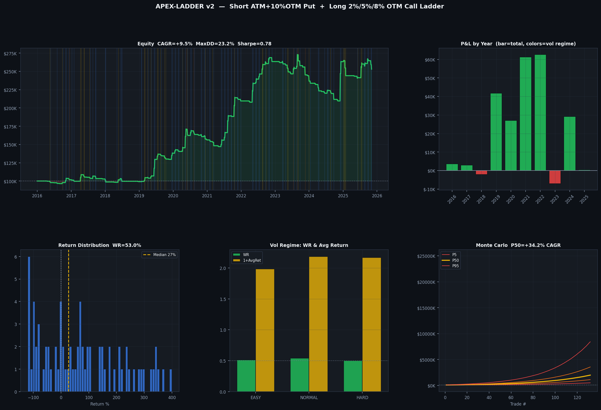

# APEX - Adaptive Position EXecution

Independent quantitative options research I built over the past two years. Three separate research threads: an intraday lead signal, a gap momentum strategy, and a systematic options structure, all running in parallel and feeding into each other.

**Stack:** Python, NumPy, SciPy, Alpaca Markets API, Black-Scholes, Monte Carlo  
**Data:** 10 years of real SPY/QQQ/PLTR/NVDA daily and intraday bars via Alpaca  
**How I worked:** Form a hypothesis, backtest it, figure out exactly why it failed, redesign, and repeat.

---

## Table of Contents

1. [Intraday Lead Signal, PLTR/NVDA predicting SPY](#1-intraday-lead-signal)
2. [Gap Momentum Strategy, 0DTE QQQ](#2-gap-momentum-strategy)
3. [Options Structure, Six Iterations](#3-options-structure-evolution)
4. [Final Strategy, APEX-LADDER](#4-final-strategy)
5. [Key Concepts](#5-key-concepts)
6. [Files](#6-files)

---

## 1. Intraday Lead Signal

**The question:** Do high-beta growth stocks front-run SPY intraday? If PLTR's first 15 minutes predicts SPY's next 60 minutes, that's a real-time filter I can wire into trade entry.

I collected 59 live trading days of 5-minute bars through Alpaca, computed first-15-minute returns for PLTR and NVDA each session, and regressed them against SPY's next-60-minute return.

**What I found:**

```
Signal                   rho      p-value
---------------------
PLTR first 15 min       +0.500    0.000
NVDA first 15 min       +0.184    0.163   (not significant alone)
Composite (PLTR+NVDA)   +0.463    0.000
```

```
R-squared breakdown:
  SPY gap alone:         0.053
  SPY + PLTR + NVDA:     0.259
  Incremental R^2:      +0.206   (4x improvement over gap alone)
```

The signal gets stronger on down-open days, rho=0.540 (p=0.002). That's exactly when you need it most. I wired it in as a live entry filter: if the composite strongly opposes the trade direction, skip it.

**Directional accuracy:**

```
Signal          N     SPY correct   Avg SPY move
------------------------
Strong UP      15        73%          +0.148%
Neutral        19        52%          +0.031%
Strong DN      25        64%          -0.211%
```

---

## 2. Gap Momentum Strategy

**The question:** Does the overnight gap between NQ futures close and QQQ open contain usable information? I suspected specific gap sizes would have asymmetric win rates, some favor continuation, others fade.

After 9 years of QQQ data, here is what the empirical zone map looked like:

```
Gap Range           Zone Name         Trade     Entry condition
-------------------------------
+0.45% to +0.65%   UP_MOD_CONT       CALL      Bull trend + IV below 25%
+0.65% to +0.75%   DEAD_ZONE_UP      None      -
above +0.75%        UP_BIG_FADE       PUT       Bear confirmed only
-0.01% to -0.18%   DN_SMALL_BOUNCE   CALL      Bull confirmed only
-0.18% to -1.50%   DEAD_ZONE_DN      None     (killed by data)
below -1.50%        DN_EXTREME        CALL      IV above 30%, prev gap negative
```

I then plugged the PLTR/NVDA composite into this as a second filter, if the composite opposes the trade, block it. This cut 82% of the UP_BIG_FADE put signals, which were the main loss source.

**Results (real QQQ data, 2016-2025):**

```
CAGR: +0.9%    Max DD: 4.6%    Sharpe: 2.28    Trades: 9/year
```

The edge is real, Sharpe 2.28 with near-zero drawdown, but nine trades a year doesn't compound meaningfully. I absorbed the zone map logic and the lead filter into the options structure work as regime classifiers.

---

## 3. Options Structure Evolution

Every version below changed because of a specific, measurable failure, not a hunch.

---

### Version 1: Symmetric Risk Reversal

Buy calls in bull regimes, buy puts in bear regimes, finance each side by selling the opposite.

```
Bull:  SELL ATM put  + BUY 3% OTM call   (net credit)
Bear:  SELL ATM call + BUY 3% OTM put    (small debit)
```

**Real data, 2018-2025:**

```
Bull side:   N=168   WR=58.9%   PnL = +$440,826
Bear side:   N= 96   WR=40.6%   PnL = -$443,912
Net PnL:                              -$3,086
```

The bear side almost exactly cancelled all the bull gains. In 2023 (SPY +26%), selling calls into the recovery cost -$86K, -$36K, -$80K, -$70K, -$52K in five consecutive months.

**Why it failed:** Put skew works against a bear risk reversal. The short ATM call is cheap (skew makes calls underpriced), and the long OTM put is expensive (skew makes puts overpriced). You're fighting the market's structural pricing every single trade.

---

### Version 2: Kill the Bear Side

If the bear structure is broken, stop trading it. Bull regime only, cash otherwise.

```
Entry condition: QQQ above SMA50 x 1.015 (confirmed uptrend, not just neutral)
Position:        SELL ATM put + BUY 3% OTM call
```

Added vol-scaled sizing here too:

```
HV below 16%:   4x size   (low vol melt-up, lean in)
HV 16-22%:      2x size   (normal)
HV 22-30%:      0.5x size (elevated, cautious)
HV above 30%:   0.25x     (survival mode)
```

**Result:** CAGR +13.4%, Max DD 10.4%, Sharpe 1.18, zero ruin.

But I found a bug, the integer division `int(risk / max_loss_per)` floored to zero when SPY crossed $1,200. Sizing was dollar-based, not percentage-based. Fixed by normalizing to `S * spread_pct * 100` so it works at any price level.

---

### Version 3: Bear Put Spread

Instead of cash in bear regimes, use a structure that exploits put skew correctly, buy the expensive ATM put, sell the cheaper OTM put.

```
Bear entry: BUY ATM put (K = S) + SELL 8% OTM put (K = S x 0.92)
Net debit ~$4-6, max profit ~$8-12 on an 8%+ drop, max loss = debit paid
```

Added three confirmation filters so it doesn't fire on shallow dips:

```python
5-day momentum < -0.5%     # market is actually falling
10-day realized vol > 13%  # real fear, not quiet drift
price is 3%+ off 20-day high  # breakdown, not just a dip
```

Bear PnL went from -$443K down to -$18K. Defined risk capped every loss.

---

### Full Iteration History

| Version | What I tried | What failed | What I changed |
|---------|-------------|-------------|----------------|
| RR v1 | Bull + Bear risk reversal | Bear: -$443K, cancelled all bull gains | Put skew structurally breaks bear RR |
| Hybrid v1 | Bull only | Bear sitting in cash | Correct, simplified |
| Hybrid v2 | Vol-scaled sizing | EASY trades never fired | Integer sizing bug at high SPY prices |
| Hybrid v3 | Bear confirmation filters | SMA50 too slow, firing on dips | Added momentum + vol + price filters |
| Ladder v2 | 5-leg zero-cost structure | Final | 10% offset put, price-invariant sizing |

---

## 4. Final Strategy

**The core realization from all six iterations:** Put skew is the most powerful force in this market. Every failure came from fighting it. The ladder collects it on the short put side and uses the proceeds to buy three calls at different strikes, three separate ways to win and one defined way to lose.

### Structure


```
Leg                   Strike      Credit/Debit   Delta
---------------------------
SHORT  ATM put         S           +$14.28       -0.455
SHORT  10% OTM put     S x 0.90    +$1.38        -0.148
LONG   2% OTM call     S x 1.02    -$10.94       +0.423
LONG   5% OTM call     S x 1.05    -$5.54        +0.258
LONG   8% OTM call     S x 1.08    -$2.50        +0.138
---------------------------
Net                                +$0.38        (small credit)
```

**Why 10% OTM for the offset put instead of 5%?**

A 5% OTM put bleeds on every normal pullback, which happens 3-4 times per year. A 10% OTM put only activates in genuine crashes. Moving from 5% to 10% gave up $3.70 of credit but dropped STOP_SPREAD exits from 19 to 3 over the backtest period. Much cleaner.

**Three ways to win:**

```
SPY up 2% to 5%:   the 2% OTM call is in the money
SPY up 5% to 8%:   the 2% and 5% calls are both printing
SPY up 8%+:        all three calls printing
Flat market:       collect theta on both short puts
```

### Dashboard



### Backtest Results (real SPY data, 10.2 years)

```
Period:          Jan 2016 to Mar 2026
Starting capital: $100,000
Ending capital:   $253,006
CAGR:            +9.5%
Max drawdown:    -23.2%
Sharpe ratio:     0.78
Trades:           132 (about 13 per year)
Win rate:         53.0%
Profit factor:    2.61
Avg winning trade: +344.8%
Avg losing trade:  -149.3%
```

**By vol regime:**

```
Regime    Trades   Win rate   Avg return   Total PnL
--------------------------
EASY        37      51.4%       +98.3%     +$22,659
NORMAL      89      53.9%      +118.5%    +$177,243
HARD         6      50.0%      +116.8%     +$19,763
```

All three regimes were profitable. The hard vol regime wins despite 0.5x sizing because the short ATM put collects dramatically more premium when volatility spikes.

**Year by year:**

```
2019   +$47K   Spring rally fired all three calls (Jun +$22.8K, Jul +$7.4K)
2020   +$27K   COVID recovery rip in May, +$25.9K on reopening momentum
2021   +$62K   Melt-up year, Oct +$27K at maximum vol sizing
2022   +$63K   Bear market paradox, elevated vol means fat put premiums
2023   -$25K   Choppy recovery, regime transitions, puts hit repeatedly
2024   +$34K   Bad January (-$10.3K) recovered into a strong December (+$54.3K)
2025   +$16K   January stop-out (-$18K), recovered in July (+$21.7K)
```

### Monte Carlo (100,000 paths, 132 trades each)

```
              P5       P25      P50      P75      P95
CAGR        +17.4%   +26.9%  +34.2%   +42.1%  +54.6%
Max DD      -16.1%   -20.7%  -24.8%   -30.0%  -39.4%
Terminal    $512K    $1.1M   $2.0M    $3.6M   $8.4M
Ruin         0.03%
Profitable  99.99%
```

**On the gap between actual and MC:** The actual path came in at +9.5% CAGR, well below the MC median of +34.2%. That gap is real and worth explaining. The bootstrap resamples trade returns independently, it doesn't know that losses cluster during regime transitions. The actual path hit three bad clusters: 2023 choppy recovery, January 2024, January 2025. Under i.i.d. sampling those losses get spread randomly across paths. The MC median tells you what happens in an average draw. The actual path tells you what happens when the market goes through a rough regime shift. I report both.

---

## 5. Key Concepts

**Put skew** means ATM puts trade roughly 8% richer than realized vol because portfolio managers constantly buy them as insurance. As the short put seller, I collect that structural premium on every trade. The 10% OTM offset put benefits from the same skew, it's cheaper than its probability of expiring in the money would suggest.

**Zero-cost construction** works because short ATM put (~$14) plus short 10% OTM put (~$1.40) equals about $15.40 in credit. The three long calls (2%, 5%, 8% OTM) cost about $15.02 combined. Net: small credit. The position is self-financing with three upside participation points built in.

**Volatility-scaled sizing** keeps dollar risk constant across environments. The formula is `contracts = risk_usd / (S * spread_pct * 100)`. At HV=12% with 3x sizing, the dollar volatility is the same as 1x sizing at HV=21%. You're not betting more in low vol, you're maintaining constant exposure.

**Price-invariant sizing** was a bug I found and fixed. The original formula used raw dollar strikes, which floored to zero via integer division when SPY crossed $1,200 in late 2024. Normalizing by percentage of spot price instead of absolute dollars fixed it across all price levels.

---

## 6. Files

```
apex_ladder_v2.py          The final strategy, 5-leg ladder, vol-scaled sizing
intraday_lead_signal.py    Stream 1, PLTR/NVDA lead signal research (59 live days)
backtest_futures.py        Stream 2, NQ gap momentum, empirical zone map
research/
  apex_hybrid_v3.py        Earlier iteration, bull RR plus bear put spread
results/
  apex_ladder_dashboard.png    6-panel performance dashboard
  apex_ladder_structure.png    Payoff diagram showing the three win zones
  apex_ladder_trades.csv       Full trade log, 132 trades over 10.2 years
```

---

## Setup

```bash
pip install numpy pandas scipy matplotlib alpaca-trade-api
export ALPACA_API_KEY=your_key
export ALPACA_API_SECRET=your_secret
```

## Run

```bash
# Full 10-year backtest on real SPY data
python3 apex_ladder_v2.py -start 2016-01-01 -end 2026-03-08 -capital 100000

# Intraday lead signal (needs live Alpaca connection)
python3 intraday_lead_signal.py

# Gap momentum backtest
python3 backtest_futures.py -start 2016-01-01 -end 2025-01-01
```

---

*Michael Rosenberg, quantitative research, systematic options*  
*michaelirosenberg@gmail.com*
